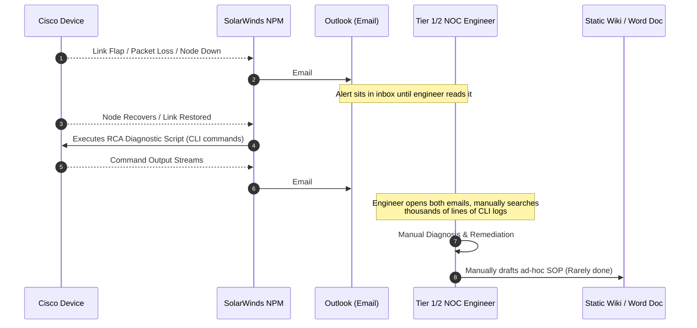
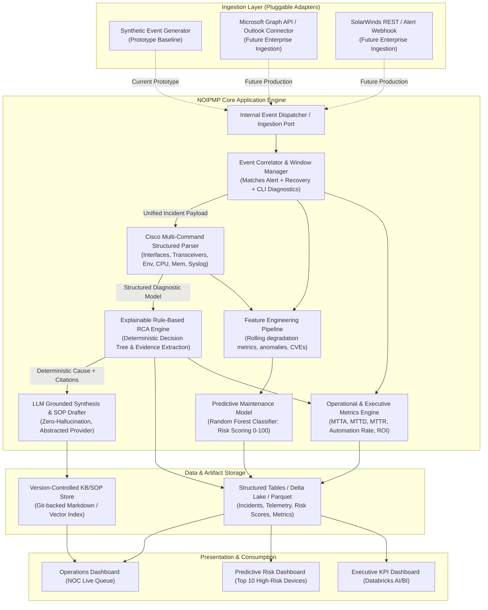

# System Architecture Document

## Project: Network Operations Intelligence & Predictive Maintenance Platform (NOIPMP)

---

## 1. Architectural Philosophy: The "Enterprise-Ready Prototype"

The architecture is built on the **Hexagonal / Clean Architecture** paradigm. The foundational principle is **Ingestion and Infrastructure Independence**:
> *The core domain logic—event correlation, Cisco diagnostic parsing, deterministic RCA rule evaluation, predictive health scoring, and SOP generation—has zero dependency on the external transport mechanism.*

Today, the system executes locally or on Databricks using a high-fidelity **Synthetic Ingestion Adapter**. Tomorrow, replacing this synthetic adapter with a **Microsoft Graph API / Outlook Webhook Adapter** and **SolarWinds REST API Connector** requires changing zero lines of correlation, parsing, ML, or RCA logic.

---

## 2. Current State vs. Future Architecture Comparison

### Current Enterprise Manual Workflow (High Latency & Toil)


### Future NOIPMP Architecture (Automated, Grounded & Predictive)


---

## 3. Detailed Data Flow & Ingestion Decoupling

### Step 1: Ingestion Adapter Abstraction
The system defines a strict contract:
```python
class EventIngestionPort(typing.Protocol):
    def ingest_alerts(self) -> typing.Iterator[SolarWindsAlertEvent]: ...
    def ingest_recoveries(self) -> typing.Iterator[SolarWindsRecoveryEvent]: ...
    def ingest_diagnostics(self) -> typing.Iterator[CiscoDiagnosticPayload]: ...
```
- **Prototype Mode:** The `SyntheticEventAdapter` reads from deterministic synthetic generation routines, injecting realistic timestamps and simulated degradation.
- **Enterprise Mode:** The `GraphAPIEmailAdapter` connects to M365 Outlook via OAuth2 client credentials, polls or receives webhooks on the network alert mailbox, parses MIME multipart bodies, and transforms email text into standard `SolarWindsAlertEvent` and `CiscoDiagnosticPayload` objects.

### Step 2: Temporal Correlation Pipeline
- Ingestion events arrive asynchronously.
- The `IncidentCorrelationManager` maintains state:
  1. Incident initialized on Alert: `state = IncidentState.ALERT_RECEIVED`.
  2. Correlates Recovery event by `device_fqdn` and matching `alert_id` or timestamp window (<60 min): `state = IncidentState.RECOVERY_RECEIVED`.
  3. Correlates Cisco Diagnostic output block: `state = IncidentState.DIAGNOSTICS_ATTACHED`.
  4. Triggers deterministic parsing and RCA.

### Step 3: Cisco Diagnostic Parsing & Deterministic Evaluation
- The raw CLI text contains multiple Cisco commands executed by the SolarWinds post-recovery action.
- The `CiscoDiagnosticParser` splits and dispatches commands to dedicated sub-parsers using robust tokenizers and regex extractors:
  - `ShowInterfacesParser`
  - `ShowTransceiverParser`
  - `ShowEnvironmentParser`
  - `ShowProcessCpuMemoryParser`
  - `ShowLoggingParser`
- The parsed entity (`CiscoDiagnosticReport`) is fed into the `DeterministicRCAEngine`.
- The rule engine runs transparent rules (R1 to R6). When conditions match, it issues a signed diagnostic verdict with exact line-item citations (e.g. `TenGigabitEthernet1/0/1 Rx power = -21.4 dBm exceeds low alarm threshold -14.0 dBm`).

### Step 4: Grounded LLM Knowledge Synthesis & SOP Generation
- The LLM service receives structured data and rules citations inside strict delimiter tags.
- It translates technical findings into an executive summary and drafts a structured Markdown Standard Operating Procedure (SOP).
- Hallucination safeguard: The system prompt prohibits introducing any CLI commands or parameters not found in the verified knowledge base or parsed evidence.

### Step 5: Predictive Risk Scoring & Health Profiling
- The `FeatureEngineeringPipeline` aggregates sliding window metrics for each device:
  - Telemetry trends: CRC error accumulation, optical drift, packet drop rates.
  - Environmental trends: Temperature margin to critical, single-power-supply anomalies.
  - Lifecycle: Software version, CVE vulnerability exposure, device age.
- The **Random Forest Classifier** infers failure likelihood over the next 14 days.
- A composite **Device Risk Score** (0–100) is calculated.
- The Top 10 High-Risk Devices are highlighted with proactive recommendations.

---

## 4. Architectural Layer Boundaries

| Layer | Responsibility | Key Classes / Interfaces | Technology |
|---|---|---|---|
| **Domain Model** | Pure entities, value objects, immutable schemas | `Device`, `Incident`, `DiagnosticReport`, `RCAResult`, `DeviceRiskScore` | Python dataclasses / Pydantic |
| **Domain Logic** | Deterministic business rules, scoring math | `DeterministicRCAEngine`, `RuleCatalog`, `HealthScoreCalculator` | Pure Python |
| **Application Layer** | Workflow orchestration, pipeline stages | `IncidentOrchestrator`, `PredictiveMaintenanceOrchestrator`, `MetricsCalculator` | Python |
| **Ports (Interfaces)** | Contract definitions for I/O and external services | `EventIngestionPort`, `IncidentRepositoryPort`, `LLMProviderPort`, `TelemetrySinkPort` | `typing.Protocol` / ABC |
| **Adapters (Inbound)** | Data ingestion from synthetic sources, CLI, or APIs | `SyntheticEventAdapter`, `GraphAPIEmailAdapter`, `CliRunner` | Python, Click / Typer |
| **Adapters (Outbound)** | Storage, LLM clients, Databricks tables | `FileIncidentRepository`, `DeltaLakeSink`, `MockLLMClient`, `OpenAIClient` | PySpark, DuckDB/SQLite, HTTPX |

---

## 5. Technology Stack Mapping

```
+--------------------------------------------------------------------------+
|                        Databricks AI/BI Dashboards                       |
|   (Operations Queue View, Predictive Maintenance Leaderboard, Exec ROI)   |
+--------------------------------------------------------------------------+
                                    ^
                                    | (SQL / Delta Lake Queries)
+--------------------------------------------------------------------------+
|                       Storage & Feature Store Layer                      |
|      Delta Lake Tables: /delta/{incidents, telemetry, risk_scores, kpi}  |
|      Version-Controlled Git KB: /docs/kb/{hardware, optical, routing}    |
+--------------------------------------------------------------------------+
                                    ^
                                    | (Write Operations)
+--------------------------------------------------------------------------+
|                     ML & Predictive Analytics Layer                      |
|         scikit-learn / PySpark MLlib (Random Forest Classifier)          |
|         Feature Pipelines (Rolling 7d/30d telemetry aggregations)        |
+--------------------------------------------------------------------------+
                                    ^
+--------------------------------------------------------------------------+
|                     Deterministic RCA & LLM Layer                       |
|         Rule-Based Evidence Engine (100% deterministic decision trees)   |
|         LLM Provider Abstraction (Azure OpenAI / Local Mock)             |
+--------------------------------------------------------------------------+
                                    ^
+--------------------------------------------------------------------------+
|               Cisco CLI Multi-Command Parsing Engine                     |
|         Regex / TextFSM-inspired token parsing (Interfaces, Logs, Env)   |
+--------------------------------------------------------------------------+
                                    ^
+--------------------------------------------------------------------------+
|                   Event Ingestion & Correlation Port                     |
|           Pluggable: Synthetic Adapter (Today) -> M365/SolarWinds (Future)|
+--------------------------------------------------------------------------+
```
