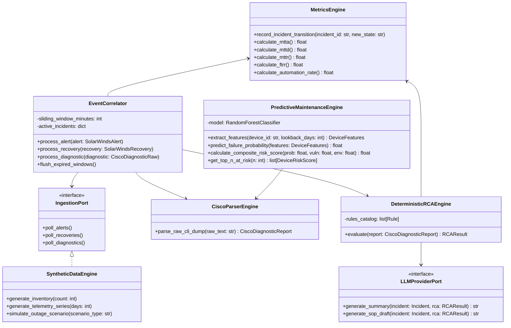

# Component Architecture Document

## Project: Network Operations Intelligence & Predictive Maintenance Platform (NOIPMP)

---

## 1. Overview of Component Topology

The system comprises seven core functional components, organized according to clean separation of concerns:
1. **Synthetic Telemetry & Scenario Generator Component**
2. **Ingestion & Sliding-Window Event Correlation Component**
3. **Cisco CLI Multi-Command Parsing Component**
4. **Explainable Deterministic RCA Component**
5. **Grounded LLM Knowledge & SOP Generation Component**
6. **Feature Engineering & ML Predictive Maintenance Component**
7. **Operational Metrics & Analytics Component**

---

## 2. Component Specifications

### 2.1 Component C-1: Synthetic Data Engine (`src/synthetic/`)
- **Primary Class:** `SyntheticGenerator`
- **Sub-Modules:**
  - `inventory_gen.py`: Generates realistic Cisco device profiles (Catalyst 9300/9500, Nexus 9300, ISR 4451) with authentic IOS-XE/NX-OS versions, serial numbers, rack locations, and transceiver types.
  - `telemetry_gen.py`: Generates 5-minute interval metrics (CPU, RAM, Temp, PSU status, In/Out Octets, CRC rates, Rx/Tx optical power).
  - `scenario_gen.py`: Implements deterministic failure scenarios:
    - *Scenario 1: SFP Optical Degradation (Rx power dropping from -9 dBm to -22 dBm with CRC accumulation).*
    - *Scenario 2: Hardware Power Supply Fault (PSU2 loss, single supply operation, warning syslog).*
    - *Scenario 3: Control Plane Memory Leak (BGP process memory climbing monotonically until buffer exhaustion).*
    - *Scenario 4: MTU Mismatch (OSPF drops, jumbo frame discards).*
    - *Scenario 5: Duplex Mismatch (Half duplex negotiation, late collisions).*
  - `cli_dump_gen.py`: Synthesizes exact Cisco CLI syntax blocks for `show version`, `show logging`, `show interfaces`, `show environment`, etc.

### 2.2 Component C-2: Event Ingestion & Correlator (`src/correlation/`)
- **Primary Classes:** `EventCorrelator`, `CorrelationSession`
- **Responsibilities:**
  - Implements the sliding time window algorithm.
  - Maintains in-memory lookup table indexed by `device_hostname` and `device_ip`.
  - Pairs Alert Event $E_{alert}$ with Recovery Event $E_{rec}$ where:
    $$\Delta t = |t_{rec} - t_{alert}| \le T_{window}$$
  - Collects post-recovery CLI diagnostic dumps and associates them to the unified `Incident` object.
  - Emits lifecycle events: `IncidentCreated`, `IncidentCorrelated`, `IncidentDiagnosticsAttached`.

### 2.3 Component C-3: Cisco Diagnostic Parsing Engine (`src/parsers/`)
- **Primary Class:** `CiscoDiagnosticParser`
- **Sub-Parsers:**
  - `InterfaceParser`: Parses Cisco IOS `show interfaces <id>` output. Extracts interface state, MTU, duplex, bandwidth, packets input/output, CRC errors, frame errors, collisions.
  - `TransceiverParser`: Parses `show interfaces transceiver detail`. Extracts Tx/Rx power (dBm), current, voltage, and threshold flags.
  - `EnvironmentParser`: Parses `show environment power` and `show environment temperature`. Extracts PSU operational status, wattage, temperature sensor readings, and alarm limits.
  - `ProcessParser`: Parses `show processes cpu sorted` and `show processes memory sorted`. Identifies top CPU and memory consumers.
  - `SyslogParser`: Parses standard Cisco syslog syntax (`%FACILITY-SEV-MNEMONIC: Description`). Extracts timestamps, severity, and event tags.
- **Output:** Returns a fully typed `CiscoDiagnosticReport` Pydantic model with typed subsections.

### 2.4 Component C-4: Explainable Deterministic RCA Engine (`src/rca/`)
- **Primary Classes:** `DeterministicRCAEngine`, `Rule`, `RuleRegistry`
- **Responsibilities:**
  - Evaluates registered rules sequentially or in priority order against `CiscoDiagnosticReport`.
  - Evaluates boolean predicate logic against parsed telemetry metrics.
  - Calculates confidence scores ($0.0 \le c \le 1.0$) based on evidence strength.
  - Generates audit citations: captures exact line numbers and parsed metric pairs that satisfied the rule.
  - Recommends structured remediation steps and verification commands.
- **Extensibility:** New rules can be registered without modifying the engine core via python decorators (`@register_rca_rule`).

### 2.5 Component C-5: LLM Knowledge Synthesis & SOP Drafter (`src/llm/`)
- **Primary Classes:** `LLMClientFactory`, `LLMProviderPort`, `MockLLMProvider`, `OpenAILLMProvider`
- **Responsibilities:**
  - Assembles prompt context with strict JSON/Markdown schema constraints.
  - Injects deterministic RCA findings and raw parsed citations as immutable context.
  - Enforces zero-hallucination system prompt.
  - Generates structured Markdown draft SOP articles formatted for the Knowledge Base.
  - Produces natural language 3-paragraph executive summaries for NOC engineers and management.

### 2.6 Component C-6: Feature Engineering & ML Predictive Engine (`src/ml/`)
- **Primary Classes:** `FeatureEngineeringPipeline`, `FailurePredictor`, `DeviceHealthScorer`
- **Responsibilities:**
  - Aggregates rolling window statistics from historical telemetry:
    - 7-day CRC delta and growth rate.
    - 7-day Optical Rx power slope ($d(\text{dBm})/dt$).
    - CPU variance and memory slope.
    - Historical outage frequency and firmware CVE severity sum.
  - Inferences using trained **Random Forest Classifier**:
    - Predicts binary probability of failure within the next 14 days.
  - Calculates composite **Device Risk Score (0–100)**:
    $$\text{Score} = (P_{\text{fail}} \times 50) + (\text{VulnScore} \times 25) + (\text{TelemetryAnomalyScore} \times 25)$$
  - Ranks the **Top 10 High-Risk Devices** across the network inventory.
  - Proactively triggers preventive maintenance work orders.

### 2.7 Component C-7: Metrics & Reporting Engine (`src/metrics/`)
- **Primary Class:** `OperationalMetricsEngine`
- **Responsibilities:**
  - Continuously recalculates:
    - **MTTA:** $\frac{1}{N}\sum (T_{\text{ack}} - T_{\text{alert}})$
    - **MTTD:** $\frac{1}{N}\sum (T_{\text{rca\_complete}} - T_{\text{alert}})$
    - **MTTR:** $\frac{1}{N}\sum (T_{\text{recovered}} - T_{\text{alert}})$
    - **First-Time Resolution Rate (FTRR):** $\frac{N_{\text{resolved\_no\_reopen}}}{N_{\text{total\_resolved}}} \times 100$
    - **RCA Automation Rate:** $\frac{N_{\text{auto\_rca}}}{N_{\text{total}}} \times 100$
    - **Incidents Prevented:** Count of high-risk proactive interventions that avoided simulated outages.
    - **KB Reuse Count:** Total incidents resolved leveraging an existing approved SOP.
