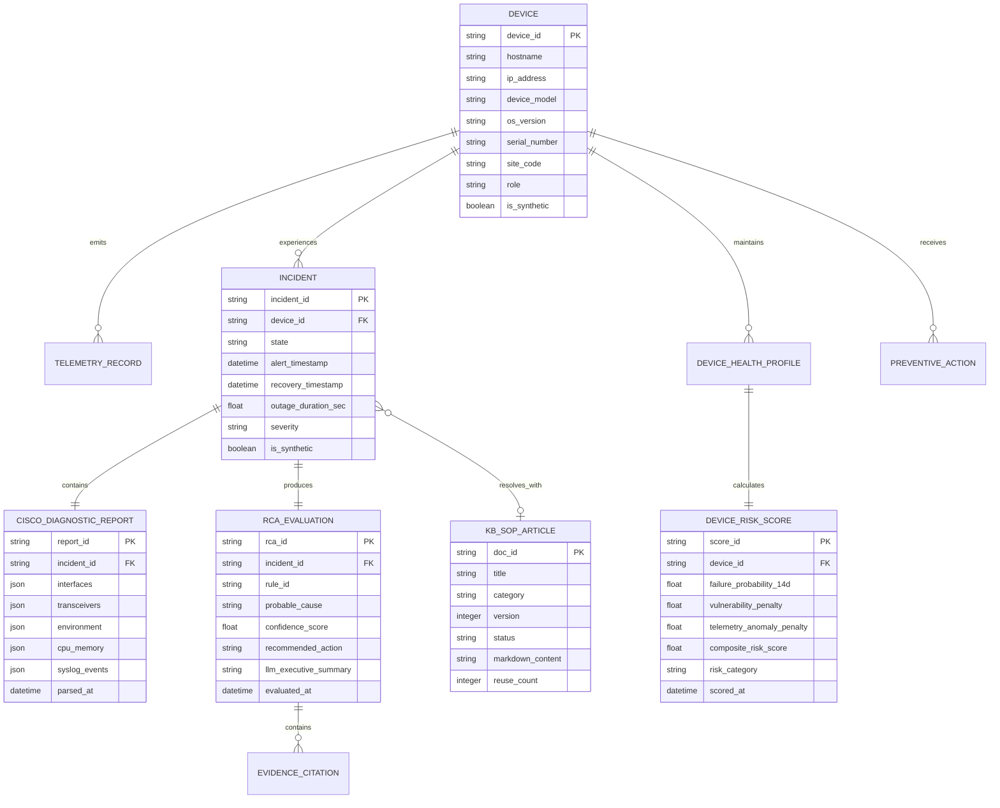

# Data Model Specification

## Project: Network Operations Intelligence & Predictive Maintenance Platform (NOIPMP)

---

## 1. Entity-Relationship Overview



---

## 2. Core Entity Definitions

### 2.1 Device Inventory (`Device`)
Represents a physical or virtual network asset in the enterprise infrastructure.
```json
{
  "device_id": "dev-c9300-nyc-01",
  "hostname": "nyc-acc-sw01.corp.internal",
  "ip_address": "10.240.12.15",
  "device_model": "Cisco Catalyst 9300-48UXM",
  "os_version": "17.09.04a",
  "os_type": "IOS-XE",
  "serial_number": "FOC2419X8KZ",
  "site_code": "NYC-HQ",
  "rack_location": "Rack-B04-U18",
  "role": "ACCESS_SWITCH",
  "hardware_eol_date": "2028-10-31",
  "installed_transceivers": [
    {
      "port": "TenGigabitEthernet1/0/1",
      "model": "SFP-10G-SR",
      "serial": "OP-9812401"
    }
  ],
  "cve_vulnerabilities": ["CVE-2023-20198", "CVE-2023-20273"],
  "is_synthetic": true
}
```

### 2.2 Telemetry Record (`TelemetryRecord`)
Periodic time-series metrics emitted by devices or polled via SolarWinds.
```json
{
  "telemetry_id": "tel-20260927-120000-01",
  "device_id": "dev-c9300-nyc-01",
  "timestamp": "2026-09-27T12:00:00Z",
  "cpu_util_pct_5m": 38.5,
  "memory_used_bytes": 3410528400,
  "memory_free_bytes": 684210000,
  "temperature_inlet_c": 28.0,
  "temperature_asic_c": 54.5,
  "psu1_status": "NORMAL",
  "psu2_status": "NORMAL",
  "interfaces": [
    {
      "name": "TenGigabitEthernet1/0/1",
      "status": "UP",
      "in_octets_rate": 4512000,
      "out_octets_rate": 8920100,
      "input_crc_errors": 1420,
      "input_errors_delta": 45,
      "rx_optical_power_dbm": -18.7,
      "tx_optical_power_dbm": -2.1,
      "link_flaps_delta": 3
    }
  ],
  "is_synthetic": true
}
```

### 2.3 Incident Record (`Incident`)
Stateful representation of an operational event from alert to resolution.
```json
{
  "incident_id": "inc-20260927-0042",
  "device_id": "dev-c9300-nyc-01",
  "device_hostname": "nyc-acc-sw01.corp.internal",
  "state": "RESOLVED",
  "severity": "CRITICAL",
  "alert_event_id": "sw-alert-892147",
  "alert_timestamp": "2026-09-27T11:42:10Z",
  "recovery_timestamp": "2026-09-27T11:51:30Z",
  "outage_duration_sec": 560.0,
  "diagnostics_attached_at": "2026-09-27T11:52:05Z",
  "rca_completed_at": "2026-09-27T11:52:12Z",
  "resolved_at": "2026-09-27T11:58:00Z",
  "first_time_resolved": true,
  "applied_kb_doc_id": "KB-OPT-0012",
  "is_synthetic": true
}
```

### 2.4 Cisco Diagnostic Report (`CiscoDiagnosticReport`)
Structured output generated from parsing the SolarWinds post-recovery CLI dump.
```json
{
  "report_id": "diag-inc-20260927-0042",
  "incident_id": "inc-20260927-0042",
  "device_hostname": "nyc-acc-sw01.corp.internal",
  "parsed_at": "2026-09-27T11:52:08Z",
  "interface_diagnostics": [
    {
      "interface_name": "TenGigabitEthernet1/0/1",
      "line_status": "UP",
      "protocol_status": "UP",
      "mtu": 1500,
      "duplex": "Full",
      "speed": "10000Mb/s",
      "input_packets": 84210992,
      "input_errors": 1845,
      "crc_errors": 1845,
      "frame_errors": 0,
      "output_errors": 0,
      "collisions": 0
    }
  ],
  "transceiver_diagnostics": [
    {
      "interface_name": "TenGigabitEthernet1/0/1",
      "transceiver_type": "SFP-10G-SR",
      "rx_power_dbm": -19.4,
      "rx_power_alarm": "LOW_ALARM",
      "tx_power_dbm": -2.1,
      "tx_power_alarm": "NORMAL"
    }
  ],
  "environment_diagnostics": {
    "psu_entries": [
      {"psu_id": "PS1", "status": "OK", "model": "PWR-C1-715WAC"},
      {"psu_id": "PS2", "status": "OK", "model": "PWR-C1-715WAC"}
    ],
    "temp_entries": [
      {"sensor": "INLET", "current_c": 28, "threshold_c": 50, "status": "OK"},
      {"sensor": "HOTSPOT", "current_c": 55, "threshold_c": 80, "status": "OK"}
    ]
  },
  "cpu_memory_diagnostics": {
    "cpu_5sec_pct": 22.0,
    "cpu_1min_pct": 21.0,
    "cpu_5min_pct": 20.0,
    "memory_used_bytes": 3410528400,
    "memory_free_bytes": 684210000,
    "top_processes": [
      {"process": "IOS-XE Core", "cpu_pct": 8.2},
      {"process": "BGP Router", "cpu_pct": 2.1}
    ]
  },
  "syslog_events": [
    {
      "timestamp": "Sep 27 11:42:08.102",
      "facility": "LINK",
      "severity": 3,
      "mnemonic": "UPDOWN",
      "message": "Interface TenGigabitEthernet1/0/1, changed state to down"
    }
  ]
}
```

### 2.5 RCA Evaluation & Citations (`RCAEvaluation`)
Explainable root cause verdict produced by the deterministic rule engine.
```json
{
  "rca_id": "rca-20260927-0042",
  "incident_id": "inc-20260927-0042",
  "matched_rule_id": "R1-OPTICAL-DEGRADATION",
  "category": "PHYSICAL_OPTICAL_LAYER",
  "probable_cause": "Optical Transceiver Degradation or Fiber Cable Micro-Bend",
  "confidence_score": 0.96,
  "evidence_citations": [
    "TenGigabitEthernet1/0/1 Rx power is -19.4 dBm (Threshold: Low Alarm < -14.0 dBm)",
    "TenGigabitEthernet1/0/1 accumulated 1,845 CRC errors",
    "Syslog confirms link down/up transition on TenGigabitEthernet1/0/1 at 11:42:08"
  ],
  "recommended_actions": [
    "Inspect physical LC fiber connector for dust or physical stress",
    "Clean fiber end-faces using one-click optical cleaner",
    "If Rx power remains below -14 dBm, replace SFP-10G-SR transceiver (Serial: OP-9812401)"
  ],
  "llm_executive_summary": "Incident inc-20260927-0042 was triggered by an intermittent link drop on interface TenGigabitEthernet1/0/1. Deterministic diagnostics confirmed critical optical receive degradation (-19.4 dBm vs -14.0 dBm alarm threshold) and 1,845 CRC errors. Immediate optical patch cable cleaning or SFP transceiver replacement is required.",
  "evaluated_at": "2026-09-27T11:52:12Z"
}
```

### 2.6 Knowledge Base / SOP Article (`KBSOPArticle`)
Structured version-controlled standard operating procedure.
```json
{
  "doc_id": "KB-OPT-0012",
  "title": "Remediation of Optical SFP Rx Degradation & CRC Errors on Catalyst 9000",
  "category": "PHYSICAL_OPTICAL",
  "version": 1,
  "status": "APPROVED",
  "created_at": "2026-09-27T11:55:00Z",
  "author": "NOIPMP-Grounded-LLM",
  "reviewed_by": "Senior Network Architect",
  "markdown_content": "# SOP: SFP Optical Power Degradation Remediation...",
  "reuse_count": 8
}
```

### 2.7 Device Risk Score (`DeviceRiskScore`)
Composite risk assessment generated by the predictive maintenance ML model.
```json
{
  "score_id": "risk-20260927-0104",
  "device_id": "dev-c9300-nyc-01",
  "device_hostname": "nyc-acc-sw01.corp.internal",
  "failure_probability_14d": 0.88,
  "vulnerability_penalty": 0.65,
  "telemetry_anomaly_penalty": 0.92,
  "composite_risk_score": 83.25,
  "risk_category": "CRITICAL",
  "top_risk_factors": [
    "Optical Rx power degraded by 5.2 dBm over trailing 14 days",
    "Rapid CRC error accumulation on TenGigabitEthernet1/0/1",
    "Unpatched Critical CVE-2023-20198 present in IOS-XE 17.09.04a"
  ],
  "recommended_preventive_action": "Schedule SFP replacement on TenGigabitEthernet1/0/1 and schedule maintenance window for IOS-XE upgrade to 17.09.05",
  "scored_at": "2026-09-27T12:00:00Z"
}
```

---

## 3. Storage Layer Mapping: Delta Lake / Parquet Tables

| Table Name | Partition Key | Storage Format | Retention / Update Pattern |
|---|---|---|---|
| `dim_device_inventory` | `site_code` | Delta Table / Parquet | SCD Type 2 (History tracking) |
| `fact_telemetry_series` | `date(timestamp)` | Delta Table / Parquet | Append-only, time-series partitioned |
| `fact_incidents` | `date(alert_timestamp)` | Delta Table / Parquet | Upsert on state transition |
| `fact_diagnostic_reports` | `date(parsed_at)` | Delta Table / Parquet | Append-only structured JSON |
| `fact_device_risk_scores`| `date(scored_at)` | Delta Table / Parquet | Daily batch append |
| `fact_operational_kpis`  | `date(period_date)` | Delta Table / Parquet | Daily rolling aggregate |
| `kb_sop_articles`        | `category` | Markdown files in Git | Versioned, pull-request reviewed |
