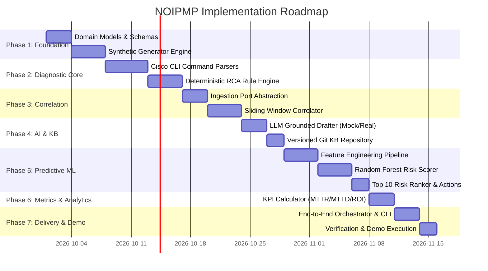

# Development Roadmap & Implementation Plan

## Project: Network Operations Intelligence & Predictive Maintenance Platform (NOIPMP)

---

## 1. Roadmap Overview & Phased Milestones

The platform is designed to be built in 7 structured, verifiable phases following the "Build Foundation First, Iterate Incrementally" methodology.

---

## 2. Phase-by-Phase Deliverables

### Phase 1: Architecture Foundation & Synthetic Data Engine
* **Goal:** Establish typed domain models, configuration loaders, and a high-fidelity synthetic Cisco network simulation.
* **Deliverables:**
  - `src/common/config.py`: Pydantic settings loading from YAML and environment variables.
  - `src/domain/models.py`: Immutable data classes for Device, Telemetry, Alert, Recovery, and Diagnostic records.
  - `src/synthetic/`: Generators for Cisco inventory (Catalyst 9300/9500, Nexus, ISR), 5-minute telemetry streams, SolarWinds alert/recovery emails, and raw CLI text blocks.
  - Ensure 100% of synthetic records are flagged `"is_synthetic": true`.
* **Exit Criteria:** Unit tests prove generator determinism with fixed seed `42` producing realistic device profiles and CLI text strings.

---

### Phase 2: Cisco CLI Parsing Engine & Explainable Deterministic RCA
* **Goal:** Ingest unstructured Cisco CLI dumps, convert them into typed reports, and evaluate deterministic root causes with exact evidence citations.
* **Deliverables:**
  - `src/parsers/`: Parsers for `show interfaces`, `show interfaces transceiver detail`, `show environment`, `show processes cpu/mem`, and syslog.
  - `src/domain/rca_rules.py`: Rules R1–R6 (Optical degradation, Duplex mismatch, PSU failure, Memory leak, CPU exhaustion, MTU mismatch).
  - `src/rca/engine.py`: Evaluator producing `RCAResult` with confidence scores and line-item citations.
* **Exit Criteria:** Parsers achieve >98% accuracy on curated golden CLI sample files; all 6 failure scenarios trigger the exact expected rule with >90% confidence.

---

### Phase 3: Pluggable Ingestion & Sliding-Window Event Correlation
* **Goal:** Decouple transport from core logic; correlate disconnected alert emails, recovery notifications, and diagnostic logs into cohesive incidents.
* **Deliverables:**
  - `src/ports/ingestion.py`: Formal `EventIngestionPort` protocol.
  - `src/adapters/ingestion/synthetic_adapter.py`: Concrete adapter pulling from synthetic generator.
  - `src/adapters/ingestion/m365_graph_stub.py`: Production-ready stub showing future Graph API swap.
  - `src/correlation/correlator.py`: Stateful sliding window (60 min) matching alerts, recoveries, and logs by device hostname and IP.
* **Exit Criteria:** Integration tests confirm out-of-order and interleaved events are correctly correlated into unified incidents.

---

### Phase 4: Grounded LLM Knowledge Synthesis & Versioned KB/SOP Management
* **Goal:** Generate plain-English executive summaries and structured Markdown SOPs without hallucinating unverified technical data.
* **Deliverables:**
  - `src/ports/llm_provider.py`: Interface definition for LLM clients.
  - `src/adapters/llm/mock_provider.py`: Fast offline template generator for CI and local development.
  - `src/adapters/llm/openai_provider.py`: Production-ready adapter supporting Azure OpenAI, OpenAI, or Ollama with strict zero-hallucination prompt guardrails.
  - `docs/kb/`: Standardized Markdown template and automated Git-based versioning for SOP articles.
* **Exit Criteria:** LLM prompt validation tests guarantee summaries cite only parsed telemetry; zero invented IP addresses or commands.

---

### Phase 5: Predictive Maintenance ML Pipeline & Risk Scoring
* **Goal:** Forecast device failures 14 days in advance using degradation trends, vulnerability exposure, and a Random Forest classifier.
* **Deliverables:**
  - `src/ml/features.py`: Aggregator calculating rolling 7-day and 30-day telemetry trends (CRC drift, optical dBm slope, CPU variance, memory leak index).
  - `src/ml/model.py`: Random Forest failure classifier trained on historical telemetry patterns.
  - `src/ml/risk_scorer.py`: Composite 0–100 health scoring and ranking of the **Top 10 High-Risk Devices**.
  - Generation of proactive work orders (`PreventiveTicketEvent`).
* **Exit Criteria:** Model achieves >80% recall on synthetic degradation test splits; Top 10 dashboard highlights degrading optical transceivers and failing PSUs before failure.

---

### Phase 6: Operational Metrics & Executive KPI Engine
* **Goal:** Quantify MTTA, MTTD, MTTR, automation rates, and cost avoidance in real-time.
* **Deliverables:**
  - `src/metrics/kpi_calculator.py`: Mathematical calculation of MTTA, MTTD, MTTR, FTRR, RCA Automation Rate, and KB Article Reuse Rate.
  - Export of metrics to local Delta/Parquet tables and JSON summaries.
* **Exit Criteria:** Automated tests verify metrics calculations against known timestamp baselines; validates that MTTD drops from 45 min manual to <2 min automated.

---

### Phase 7: End-to-End Orchestration, Dashboard Integration & Demo Execution
* **Goal:** Deliver an executable CLI and dashboard harness enabling full lifecycle demonstration.
* **Deliverables:**
  - `src/main.py`: Interactive CLI with commands:
    - `run-simulation`: Ingests synthetic stream, correlates events, runs RCA, and scores risk.
    - `show-incidents`: Displays active and resolved incident queue.
    - `show-risk`: Displays the Top 10 High-Risk Devices and recommended preventive tickets.
    - `show-kpis`: Displays executive operational metrics.
  - `notebooks/`: Databricks AI/BI compatible SQL queries and PySpark feature jobs.
* **Exit Criteria:** Clean execution of the full demo scenario from incident alert to proactive prevention without manual intervention.
