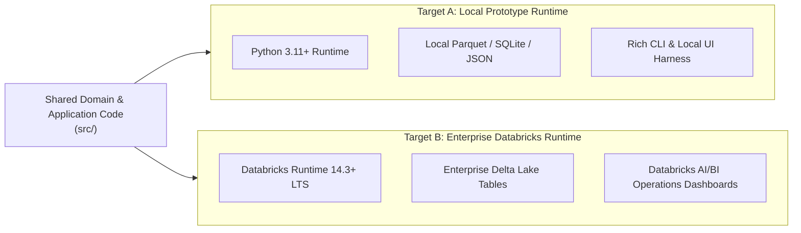
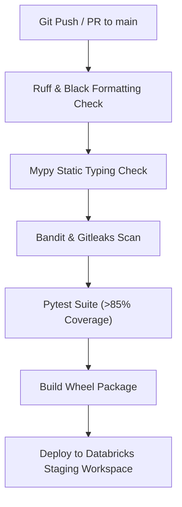

# Deployment Strategy & Infrastructure Roadmap

## Project: Network Operations Intelligence & Predictive Maintenance Platform (NOIPMP)

---

## 1. Dual-Target Deployment Architecture

The NOIPMP platform is architected for dual-target execution:
1. **Target A: Local Developer Prototype** (Zero cloud cost, rapid iteration, fully self-contained).
2. **Target B: Enterprise Databricks Lakehouse** (Production scale, scheduled PySpark pipelines, AI/BI dashboards).



---

## 2. Target A: Local Developer Prototype Runtime

* **Environment:** macOS or Linux workstation, Python 3.11+.
* **Packaging:** Standard Python project with `pyproject.toml`.
* **Storage:** Local file system under `data/delta_lake/` and `data/synthetic/` using fast Parquet serialization or DuckDB.
* **Execution:**
  ```bash
  # 1. Clone repository & setup virtual environment
  python3.11 -m venv .venv
  source .venv/bin/activate
  pip install -e ".[dev]"

  # 2. Run test suite
  pytest tests/

  # 3. Execute platform prototype simulation
  python src/main.py run-simulation --devices 100 --scenarios all
  ```

---

## 3. Target B: Enterprise Databricks Lakehouse Environment

* **Runtime:** Databricks Runtime (DBR) 14.3+ LTS (includes Python 3.11, PySpark 3.5, MLlib, scikit-learn).
* **Architecture in Databricks:**
  - **Medallion Architecture:**
    - **Bronze Layer (`raw_events`):** Raw unparsed email alerts and Cisco CLI outputs.
    - **Silver Layer (`parsed_diagnostics`, `correlated_incidents`):** Structured schemas, parsed telemetry metrics, and normalized syslog events.
    - **Gold Layer (`device_risk_scores`, `operational_kpis`):** Aggregated risk rankings, Top 10 High-Risk device views, MTTR/MTTD executive summaries.
  - **Workflow Orchestration:** Databricks Workflows / Jobs running scheduled Python tasks:
    1. `Job 1: Ingestion & Correlation Job` (Triggered on new event arrival or streaming interval).
    2. `Job 2: Daily Predictive Risk Scoring Job` (Runs daily at 02:00 AM UTC).
    3. `Job 3: Executive Metrics Aggregation Job` (Runs hourly).
* **Databricks AI/BI Integration:**
  - AI/BI Dashboards connect directly to Gold Delta tables:
    - `gold_operational_kpis`
    - `gold_top_10_risk_devices`
    - `gold_incident_summary`

---

## 4. Production Migration Path: Transitioning from Synthetic to Real Ingestion

The transition from prototype to enterprise production requires **zero changes to the core correlation or parsing engine**:

```
[PROTOTYPE TODAY]
Synthetic Generator ---> SyntheticEventAdapter ---> EventCorrelator ---> CiscoParser ---> RCA Engine
                                                          ^
                                                          | (Zero domain code changes)
[ENTERPRISE TOMORROW]                                     |
SolarWinds Webhook/Email ---> M365GraphAPIAdapter --------+
```

### Migration Steps:
1. **Step 1: Deploy Outlook/Microsoft Graph Connector:**
   - Configure Azure AD Enterprise Application registration with `Mail.Read` permissions on the NOC alert mailbox.
   - Activate `src/adapters/ingestion/m365_graph_stub.py` into a production adapter polling or subscribing to Graph Webhooks.
2. **Step 2: Connect SolarWinds Alert Script:**
   - Verify that the SolarWinds post-recovery action script delivers standard command blocks (`show interfaces`, `show transceiver`, `show env`).
   - Route recovery diagnostic emails to the designated NOC mailbox.
3. **Step 3: Point to Enterprise Delta Lake:**
   - Configure connection settings in `config/default.yaml` to write directly to Unity Catalog / S3 / ADLS storage.
4. **Step 4: Connect Enterprise LLM Service:**
   - Supply enterprise Azure OpenAI endpoint and API key via Databricks Secret Scope.

---

## 5. Continuous Integration & Deployment (CI/CD)


