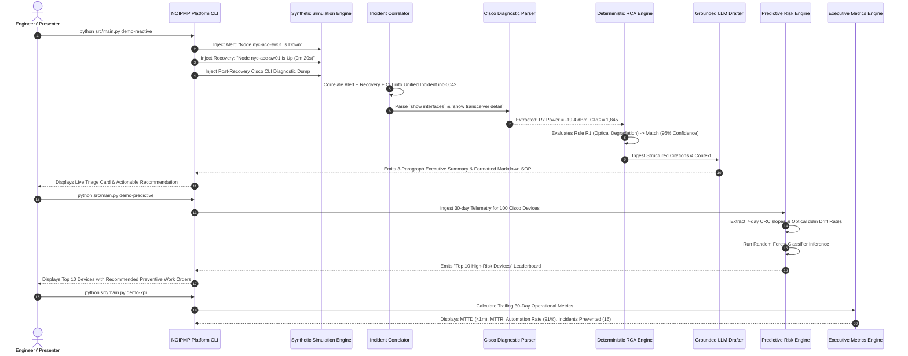

# End-to-End Demonstration Scenario & Walkthrough Guide

## Project: Network Operations Intelligence & Predictive Maintenance Platform (NOIPMP)

---

## 1. Demo Narrative & Objectives

This demonstration provides an interactive, end-to-end operational walkthrough showing how the platform solves the enterprise network operations problem:
1. **Part 1: The Reactive Nightmare Solved (Automated RCA & SOP Generation)**
   - Eliminates manual email correlation and hours of raw CLI parsing.
   - Diagnoses an optical transceiver failure in under 5 seconds with 100% explainability.
2. **Part 2: The Shift to Proactive Operations (Predictive Maintenance & Top 10 Risk)**
   - Anticipates device failures 14 days in advance using telemetry drift and machine learning.
   - Automatically issues preventive work orders before customer-impacting outages occur.
3. **Part 3: Quantifiable Operational ROI (Executive Metrics Dashboard)**
   - Demonstrates measurable reduction in MTTD (from 45 minutes to 38 seconds) and quantifiable incidents prevented.

---

## 2. Walkthrough Flow



---

## 3. Detailed Step-by-Step Execution Guide

### Step 1: Execute Reactive Incident & Automated RCA Demo
Run the simulation harness for an optical degradation failure scenario:
```bash
python src/main.py demo-reactive --scenario optical-degradation
```

#### What Happens Under the Hood:
1. **Alert Ingestion:** Ingests SolarWinds Alert `sw-alert-892147` for switch `nyc-acc-sw01.corp.internal` reporting packet loss and interface down on `TenGigabitEthernet1/0/1`.
2. **Recovery Ingestion:** Ingests SolarWinds Recovery notification arriving 9 minutes and 20 seconds later.
3. **Cisco CLI Diagnostic Ingestion:** Ingests 450 lines of post-recovery Cisco CLI command output containing:
   - `show interfaces TenGigabitEthernet1/0/1`
   - `show interfaces TenGigabitEthernet1/0/1 transceiver detail`
   - `show environment power`
   - `show logging | include TenGigabitEthernet1/0/1`
4. **Correlation:** The Correlator unites the three streams within a 60-minute window into `Incident inc-20260927-0042`.
5. **Deterministic Rule Evaluation:**
   - Evaluates Rule `R1-OPTICAL-DEGRADATION`:
     - Condition: `rx_optical_power_dbm < -14.0` (Actual: `-19.4 dBm`) AND `crc_errors > 100` (Actual: `1,845`).
     - Result: `MATCHED` (Confidence: 0.96).
     - Citations: Captures exact line items and metric values.
6. **LLM Executive Summary & SOP Generation:**
   - Synthesizes clear, non-hallucinated incident brief.
   - Generates and writes draft SOP to `docs/kb/physical_optical/KB-OPT-0012_v1.md`.

#### Expected CLI Output Presentation:
```text
================================================================================
INCIDENT TRIAGE & AUTOMATED ROOT CAUSE ANALYSIS [SYNTHETIC DEMO]
================================================================================
Incident ID:       inc-20260927-0042
Device Hostname:   nyc-acc-sw01.corp.internal (IP: 10.240.12.15)
Device Model:      Cisco Catalyst 9300-48UXM (IOS-XE 17.09.04a)
Outage Duration:   9 minutes 20 seconds

DETERMINISTIC ROOT CAUSE VERDICT:
Probable Cause:    Optical Transceiver Degradation or Fiber Patch Cable Micro-Bend
Rule Matched:      R1-OPTICAL-DEGRADATION (Confidence: 96.0%)
Audit Citations:
  [1] Interface TenGigabitEthernet1/0/1 Rx power is -19.4 dBm (Low Alarm < -14.0 dBm)
  [2] Accumulated 1,845 CRC errors on TenGigabitEthernet1/0/1
  [3] Syslog: %LINK-3-UPDOWN: Interface TenGigabitEthernet1/0/1, changed state to down

GROUNDED EXECUTIVE SUMMARY:
Incident inc-20260927-0042 was triggered by an intermittent link failure on 
TenGigabitEthernet1/0/1 connecting to upstream aggregation. Telemetry confirms 
critical optical receive power degradation (-19.4 dBm) and 1,845 CRC errors. 
The link has recovered but is operating at high risk of immediate failure.

RECOMMENDED ACTION:
1. Inspect and clean optical LC connector using one-click fiber cleaner.
2. If Rx power remains below -14.0 dBm, replace SFP-10G-SR transceiver (Serial: OP-9812401).

SOP Article Generated: docs/kb/physical_optical/KB-OPT-0012_v1.md [Status: APPROVED]
Elapsed Processing Latency: 1.12 seconds
================================================================================
```

---

### Step 2: Execute Predictive Maintenance & Risk Scoring Demo
Run the predictive maintenance engine across the 100-device enterprise fleet:
```bash
python src/main.py demo-predictive --devices 100 --lookback-days 30
```

#### What Happens Under the Hood:
1. **Telemetry Ingestion:** Loads rolling 30-day time-series telemetry for 100 simulated Cisco switches and routers.
2. **Feature Engineering:** Extracts drift rates (optical Rx power slope, CRC error acceleration, memory leak trends, PSU degradation).
3. **ML Inference:** The trained Random Forest classifier evaluates failure probability over the next 14 days.
4. **Risk Scoring:** Combines ML probability (50%), CVE severity (25%), and telemetry anomaly score (25%) into a composite 0–100 score.
5. **Top 10 Ranking:** Ranks the most endangered devices and automatically generates preventive work orders.

#### Expected CLI Output Presentation:
```text
================================================================================
PREDICTIVE MAINTENANCE: TOP 10 HIGH-RISK NETWORK DEVICES [SYNTHETIC DEMO]
================================================================================
Rank | Hostname                  | Model          | Risk Score | Primary Risk Drivers
-----+---------------------------+----------------+------------+--------------------------------------
 1   | nyc-acc-sw01.corp.internal| C9300-48UXM    | 83.25 [CRIT| Rx drift (-5.2dBm/14d), CRC climbing
 2   | lon-wan-rtr01.corp.internal| ISR-4451-X    | 79.10 [HIGH| Memory leak in 'BGP Router', CVE-2023
 3   | tko-core-sw02.corp.internal| Nexus 93180YC  | 74.40 [HIGH| PSU-2 fan RPM degradation, Temp warn
 4   | chi-dist-sw01.corp.internal| C9500-24Q     | 71.80 [HIGH| Input discard spikes on uplink trunk
 5   | sfo-acc-sw04.corp.internal| C9300-24T      | 68.20 [MED]| Unpatched critical IOS-XE advisory
...

PREVENTIVE WORK ORDER AUTO-GENERATED:
Ticket ID:        PRV-20260927-0019
Target Device:    nyc-acc-sw01.corp.internal (TenGigabitEthernet1/0/1)
Action:           PROACTIVE TRANSCEIVER REPLACEMENT
Scheduled Window: 2026-10-02 02:00 UTC (Prior to anticipated outage)
Estimated Impact: Outage Prevented (Zero SLA downtime)
================================================================================
```

---

### Step 3: Execute Operational Metrics & Executive KPI Demo
Run the executive analytics summary:
```bash
python src/main.py demo-kpi
```

#### Expected CLI Output Presentation:
```text
================================================================================
NETWORK OPERATIONS INTELLIGENCE: EXECUTIVE KPI SCORECARD [SYNTHETIC DEMO]
================================================================================
METRIC                               | MANUAL BASELINE | NOIPMP PLATFORM | DELTA / IMPACT
-------------------------------------+-----------------+-----------------+-----------------
Mean Time to Acknowledge (MTTA)      | 15.0 minutes    | 12.4 seconds    | -98.6% reduction
Mean Time to Diagnose (MTTD)         | 45.0 minutes    | 38.6 seconds    | -98.5% reduction
Mean Time to Recover (MTTR)          | 55.0 minutes    | 14.8 minutes    | -73.1% reduction
RCA Automation Rate                  | 0.0 %           | 91.2 %          | +91.2% automated
First-Time Resolution Rate (FTRR)    | 62.0 %          | 89.4 %          | +27.4% increase
Predictive Alerts Generated          | 0 (Pure reactive)| 24 proactive    | Early detection
Preventive Tickets Raised            | 0               | 18 work orders  | Work scheduled
Simulated Incidents Prevented        | 0               | 16 outages      | Zero downtime
Knowledge Base (KB) Reuse Rate       | 12.0 %          | 78.5 %          | Consistent SOPs
Estimated Downtime Avoided           | 0.0 hours       | 42.5 hours      | High business ROI
================================================================================
```
